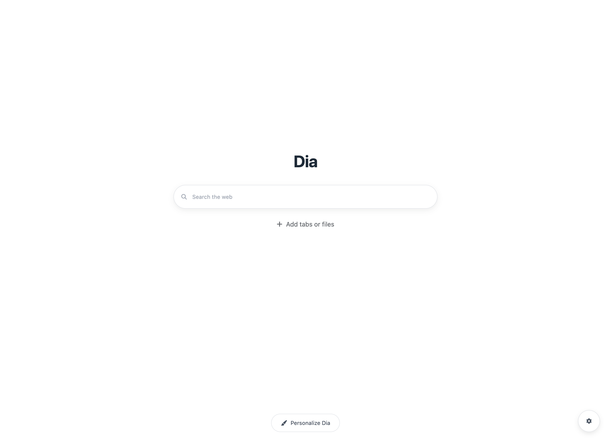

# Dia Tab

一个受 [Dia Browser](https://www.diabrowser.com/) 启发的 Chrome 新标签页扩展。

## 预览



## 功能特性

- 简洁优雅的新标签页界面
- 快速搜索功能
- 个性化设置选项
- 现代化的 UI 设计
- 响应式布局

## 技术栈

- React 19
- TypeScript
- TailwindCSS
- WXT (Web Extension Tools)

## 安装说明

### 开发环境

1. 克隆项目

```bash
git clone https://github.com/yourusername/dia-tab.git
cd dia-tab
```

2. 安装依赖

```bash
pnpm install
```

3. 启动开发服务器

```bash
pnpm dev
```

### 构建生产版本

```bash
pnpm build
```

## 使用方法

1. 打开 Chrome 浏览器
2. 进入扩展管理页面 (chrome://extensions/)
3. 开启"开发者模式"
4. 点击"加载已解压的扩展程序"
5. 选择项目中的 `.output` 目录

## 项目结构

```
dia-tab/
├── assets/          # 静态资源
├── entrypoints/     # 扩展入口点
├── public/          # 公共资源
├── .wxt/            # WXT 配置
├── webfonts/        # 网页字体
└── ...
```

## 开发指南

- 使用 `pnpm dev` 启动开发服务器
- 使用 `pnpm build` 构建生产版本
- 使用 `pnpm zip` 打包扩展

## 许可证

MIT License

## 致谢

- 灵感来源于 [Dia Browser](https://www.diabrowser.com/)
- [juchats](https://www.juchats.com/) 根据截图生成代码 [dia-tab](./dia-tab.html) 与 icon
- 使用 [WXT](https://wxt.dev/) 构建扩展
- 使用 [TailwindCSS](https://tailwindcss.com/) 进行样式设计
